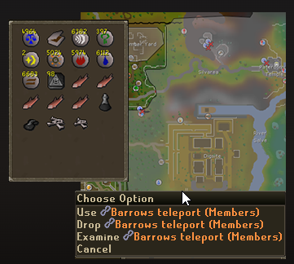

# F2P Utilities

A RuneLite plugin for Free-to-Play players that highlights members-only items and areas with customizable visual overlays. Helps you quickly identify what you can and can't use while playing on F2P worlds.

## Features

### Item Overlay

Visual indicators for members-only items in your inventory, equipment, and bank:

| Mode | Description |
|------|-------------|
| **Black and White** | Converts members items to grayscale |
| **Outline** | Draws a colored outline around members items |
| **Fill** | Fills members items with a colored overlay |

- **Item icon** — Optional icon prefix for members item names (0–390). Use `-1` to disable.
- **Exclude items** — Right-click items while holding your configured keybind to exclude them from the overlay. Access via **F2P Utilities** → **Exclude from overlay** / **Include in overlay** in the context menu.

### World Map

- Grayscale overlay on members-only areas outside the F2P region
- Normal-colored F2P area with customizable border
- Override areas for special cases (e.g. members areas within F2P, non-members areas outside F2P)
- Configurable border color, thickness, fill color, and alpha

## Configuration

### Item Overlay Settings

| Option | Description |
|--------|-------------|
| **Overlay Active** | When to show overlays: Always, Never, or Free Worlds Only |
| **Item Icon** | Icon ID for members item names (0–390, -1 = none) |
| **Item Mode** | Black and White, Outline, or Fill |
| **Item Overlay Color** | Color for outline and fill modes |
| **Item Overlay Alpha** | Transparency (0–255) |
| **Exclude Keybind** | Hold and right-click items to exclude/include from overlay |

### World Map Settings

| Option | Description |
|--------|-------------|
| **Show Map Overlay** | Toggle the world map overlay |
| **Border Color** | Color of the F2P area border |
| **Border Thickness** | 1–10 |
| **Fill Color** | Grayscale overlay fill color |
| **Overlay Alpha** | Transparency (0–255) |

## Icon Reference

Available icon IDs for the Item Icon setting (0–390):

## Support

- **Author**: Mark7625
- **Support**: [GitHub](https://github.com/Mark7625/runelite-external-plugins/tree/f2p-highlight)
