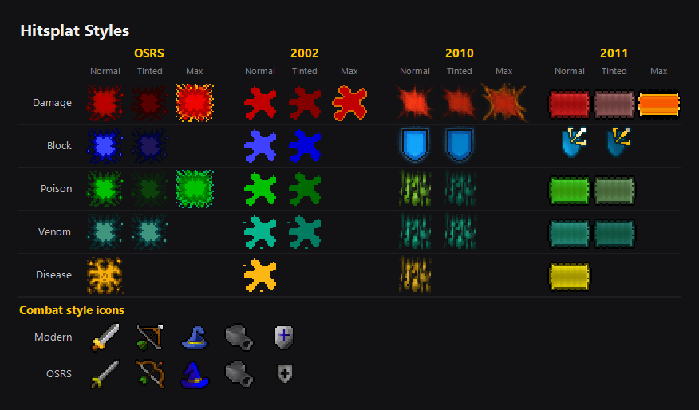

# Hitsplat Styles

Gives your hitsplats the look of an older RuneScape. Pick a year and every hit, block, poison,
venom, disease, burn and bleed splat is drawn in that era's art.

## What it does

- **Four looks to choose from** - OSRS, 2002, 2010 and 2011.
- **Combat style icons** - a little melee, ranged, magic or cannon icon next to each hit, so you can
  see at a glance what landed. Comes in a modern or an OSRS flavour.
- **Mix and match blocks** - stay on OSRS splats but borrow the 2010 or 2011 shield for blocks.
- **Cleaner blocks** - drop the `0` and the icon from blocked hits so the shield speaks for itself.
- **Heal splats** - the game draws nothing when you heal, so this does, with the food or potion that
  did it beside the number.
- **Burn and bleed** - covered too, in every style.
- **Resize them** - scale the art up without blurring it, so the pixel art stays sharp.
- **Float and fade** - splats drift up and fade away instead of blinking out.
- **Drop shadows** - a soft shadow so splats stand out against bright ground.
- **Tinting** - the game dims hits you had no hand in. Keep it, switch it off, or dim everything.

## Settings

| Setting | Default | What it does |
| --- | --- | --- |
| Style | 2010 | The era your splats are drawn in |
| Splat size | 100 | Scales the art, as a percentage. Stays sharp rather than blurring |
| Tint other people's hits | Game default | Dim hits you had no part in, as the game does |

### Blocked hits

| Setting | Default | What it does |
| --- | --- | --- |
| OSRS block splat | Default | Borrow the 2010 or 2011 shield for blocks while on OSRS |
| Hide damage text | On | No `0` on blocked hits |
| Hide style icon | On | No style icon on blocked hits |

### Combat style icons

| Setting | Default | What it does |
| --- | --- | --- |
| Icon set | Modern | Which icon set sits beside the splat |
| Gap from splat | 4 | Pixels between the icon and the splat. Negative overlaps them |

### Shadow and fade

| Setting | Default | What it does |
| --- | --- | --- |
| Shadow width | 2 | How far the shadow spreads. `0` draws none |
| Fade out | On | Float up and fade instead of vanishing |
| Fade length | 25 | How long that fade lasts, in client cycles |

### Heal splats

| Setting | Default | What it does |
| --- | --- | --- |
| Show heal splats | Splat with item | Off, splat only, or the splat plus what healed you |
| Show overheal | Off | Show what the food was worth, not what you had room for |

## Seen a wrong splat?

The combat style icon is worked out from what hit you - the projectile, the attacker's weapon, or
their animation - so it can guess wrong, and a splat type the plugin doesn't cover yet will fall
back to plain damage art. Both are easy to fix once I can reproduce them.

Please open an issue at
[github.com/Mark7625/runelite-external-plugins/issues](https://github.com/Mark7625/runelite-external-plugins/issues)
with:

- **Which style** you had selected, and which icon set.
- **What you were fighting**, or who was fighting you.
- **The weapon or spell** involved - the exact one, since the icon is picked from it.
- **What it showed, and what it should have been** - "melee icon on a blowpipe hit", say.
- **A screenshot** if you can. It usually answers all of the above at once.

## Good to know

The game only loads its hitsplat graphics when you log in, so if you turn the plugin on while you're
already in game you'll get a chat message asking you to relog. Turning it off is the same - the old
splats come back on your next login.

### About heal splats

The game has no hitsplat for most healing, so this one is invented. A few things follow from that:

- **It only ever shows on you**, never on anyone else.
- **It borrows a slot.** Real hits own the four hitsplat slots, so a heal splat takes a free one and
  drops below the stack the moment a real hit wants it back.
- **Natural regeneration is ignored**, so idling doesn't litter the screen.
- **The item icon only covers food and potions.** Heals from gear - a godsword special, Guthan's -
  still show a splat, just without an icon, because the item tables that identify what healed you
  only describe things you eat or drink.
- **It needs the Item Stats plugin**, which is where those tables live. Enabling Hitsplat Styles
  switches it on for you.
