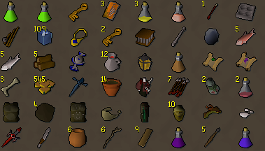
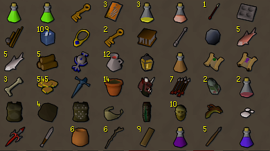
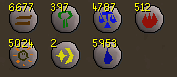
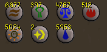
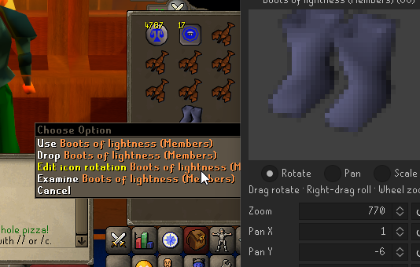

# HQ Item Icons

Sharper, high quality item icons. Renders each item's 3D model with antialiasing instead of
using the game's default icon, in your inventory, bank, and equipment.

## Before / After

<table>
<tr>
<th>Before</th>
<th>After</th>
</tr>
<tr>
<td></td>
<td></td>
</tr>
<tr>
<td></td>
<td></td>
</tr>
</table>

## Custom icon rotations

Hold **Shift** and right-click any item to get an **Edit icon rotation** option, which opens an
editor for that item's icon camera. Drag the preview to rotate, right-drag to roll, and scroll to
zoom, or switch to Pan or Scale to drag those instead — the nine fields underneath match the
item definition's own `zoom2d` / `xOffset2d` / `yOffset2d` / `xan2d` / `yan2d` / `zan2d` /
`resizeX` / `resizeY` / `resizeZ`.

## Config

- **Icon cache storage** — `Memory` (default) or `Disk`. Disk keeps rendered icons between
  client restarts so they don't need to be re-rendered.
- **Icon quality** — `Low`, `Medium` (default), or `High`. Controls how much antialiasing is
  used when rendering each icon; higher quality looks smoother but takes longer to render.
- **Render threads** — how many background threads render icons at once. Higher can be faster
  when many are queued (e.g. opening a full bank), at the cost of more CPU.
- **Custom icon rotations** — on by default. Turn off to ignore any custom rotations you've
  saved and render every item's default icon. Saved rotations aren't deleted.
- **Edit icon rotation hotkey** — what to hold while right-clicking to get the edit option.
  `Shift` by default.

## Plugin API

Other plugins can clear a cached icon, or listen for this one starting and stopping, via
RuneLite's `PluginMessage`. See [docs/api.md](docs/api.md).

## Credit

Original idea by Maiz.
